# DocuLite CMS

DocuLite CMS is a lightweight, Documentum-inspired content management system. It was initially developed in 2005, maintained and regularly upgraded until 2016, and is now archived on GitHub in read-only form.

The core component responsible for database querying—**JMFC**—remains relevant and is intended to be preserved as a stable backend layer. However, the user interface requires a major rework to become mobile friendly (e.g., using Bootstrap and/or Angular). Additional work is also required to secure the application by applying modern security best practices and integrating a suitable security approach/framework where appropriate.

## Repository status

- **Project status:** Archived (read-only)
- **Last active maintenance:** 2016
- **Core kept:** JMFC (querying/backend layer)
- **Needs work (future effort):**
  - UI modernization (mobile friendly)
  - Application hardening / security improvements

## Key concepts

- **JMFC:** Core database querying component (Documentum DFC-like concept).
- **UI layer:** Requires modernization and responsive redesign.
- **Security:** Requires additional hardening to meet modern baseline security expectations.

## Getting started (archive)

This repository is provided as an archive. There is no guarantee that it will run on modern PHP/MySQL stacks without changes.

If you decide to resume development, typical next steps would include:
1. Review current codebase and dependencies
2. Determine a target runtime (PHP version, web server, DB version)
3. Modernize the UI to support mobile devices
4. Apply security hardening (authentication/authorization, input validation, CSRF protection, session hardening, and other standard protections)

## Screenshots

  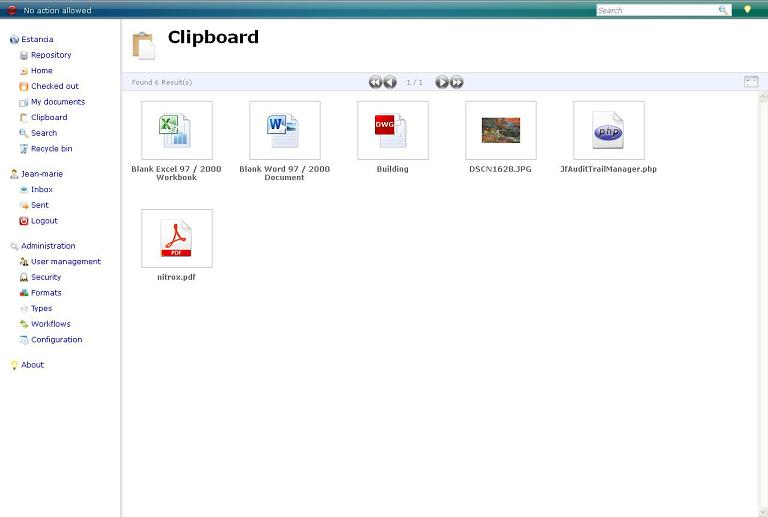
  
Clipboard view / copy-like functionality.

 

  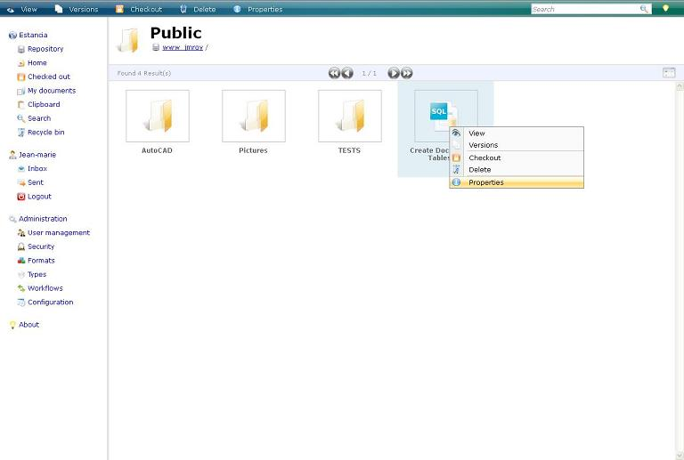
  
Contextual (right-click) menu.

 

  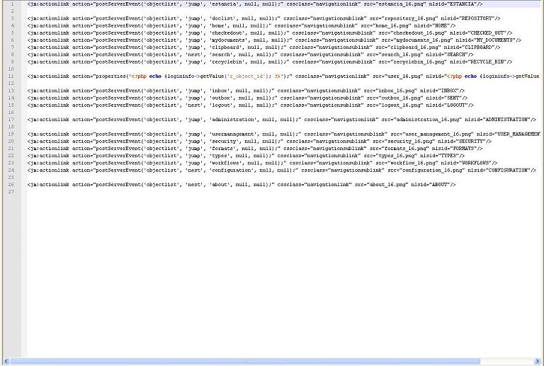
  
Customization screen.

 

  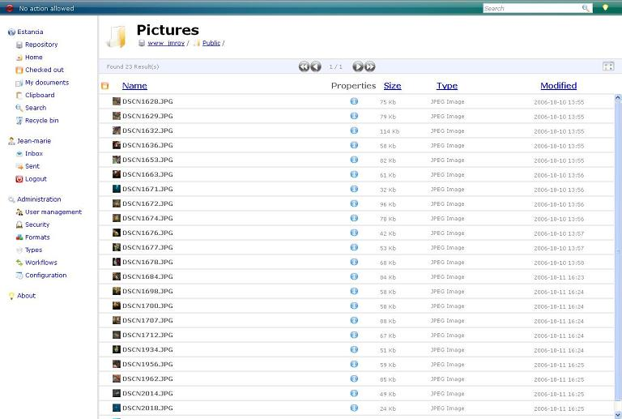
  
Details panel / item details view.

 

<!--div align="center">
  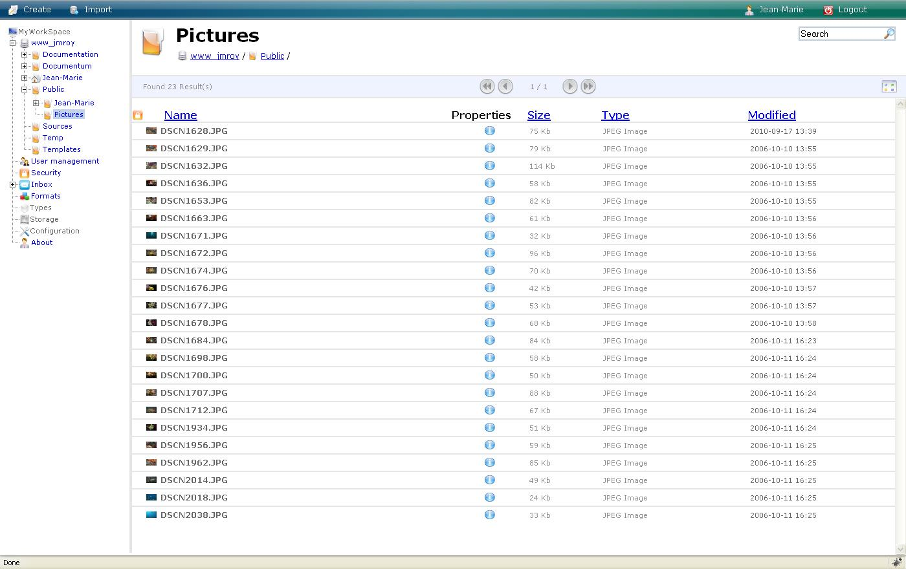
  
Document list view.

<br-->

  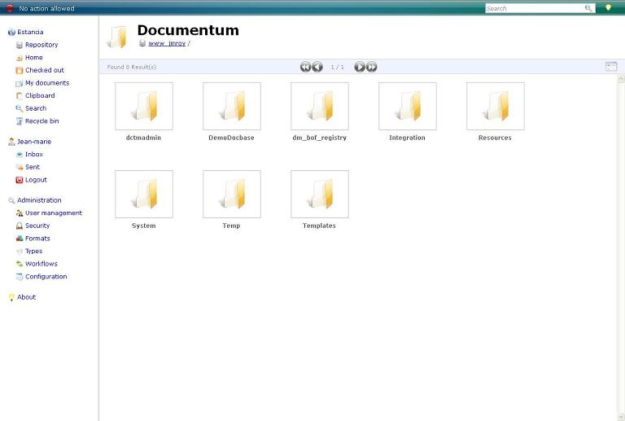
  
Documentum integration / Documentum 6-related UI.

 

  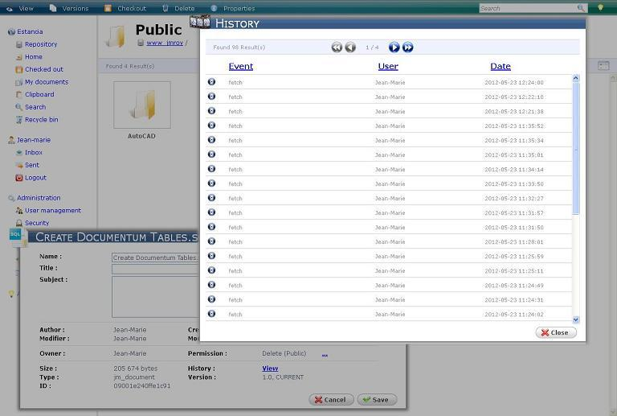
  
Drag-and-drop interaction.

 

  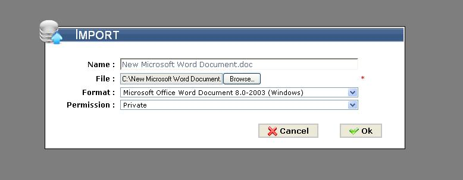
  
Import screen.

 

<!--div align="center">
  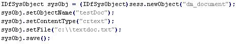
  
Java-related configuration or screen.

<br-->

  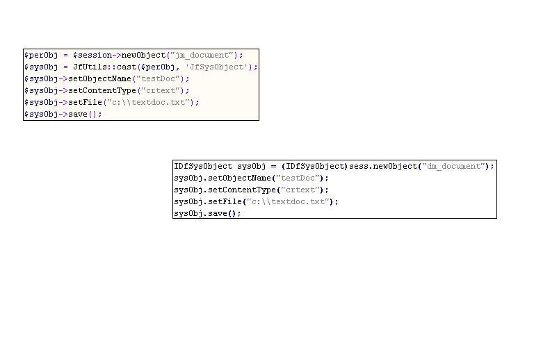
  
JMFC vs DFC mapping / related UI view.

 

  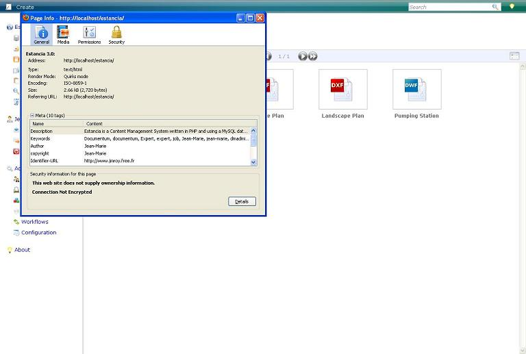
  
Lightweight mode / lightweight interface.

 

  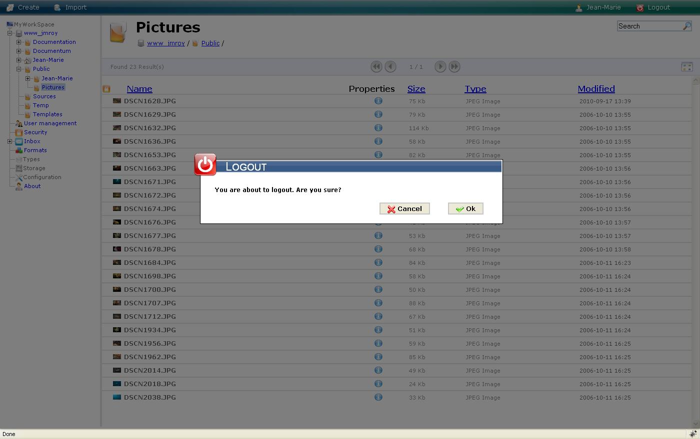
  
Logout screen.

 

  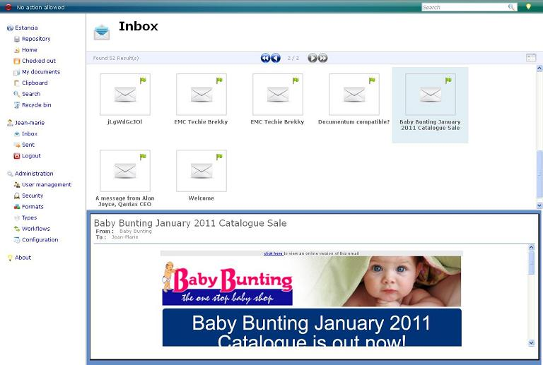
  
Mails / email-related functionality.

 

  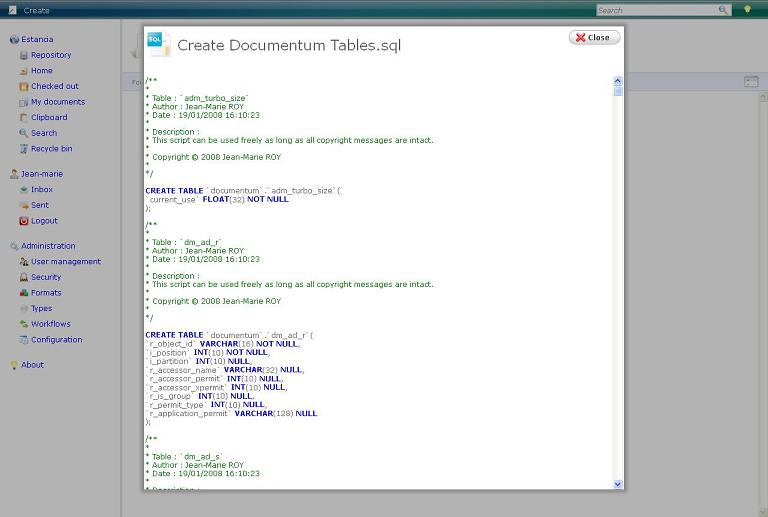
  
Modal dialog UI.

 

  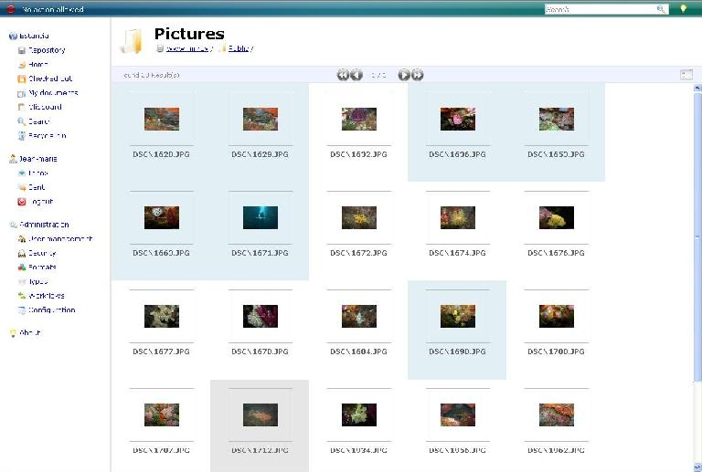
  
Multiple selection behavior.

 

<!--div align="center">
  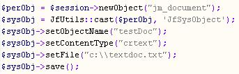
  
PHP-related configuration or screen.

<br-->

  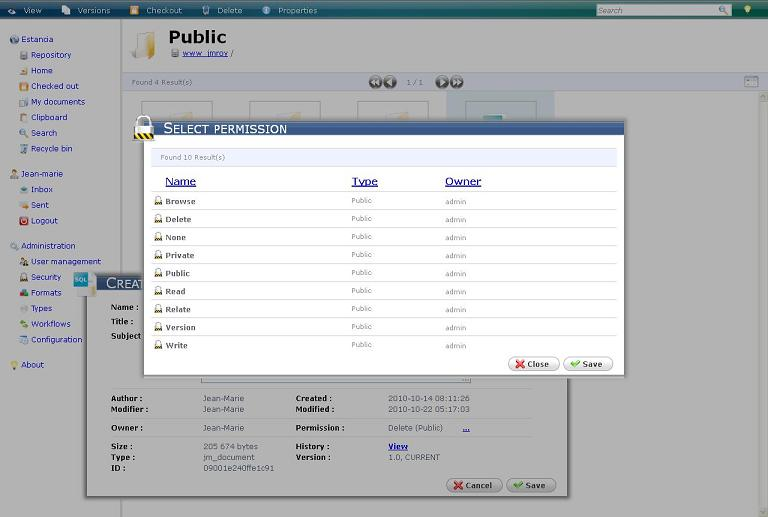
  
Security settings / security screen.

 

  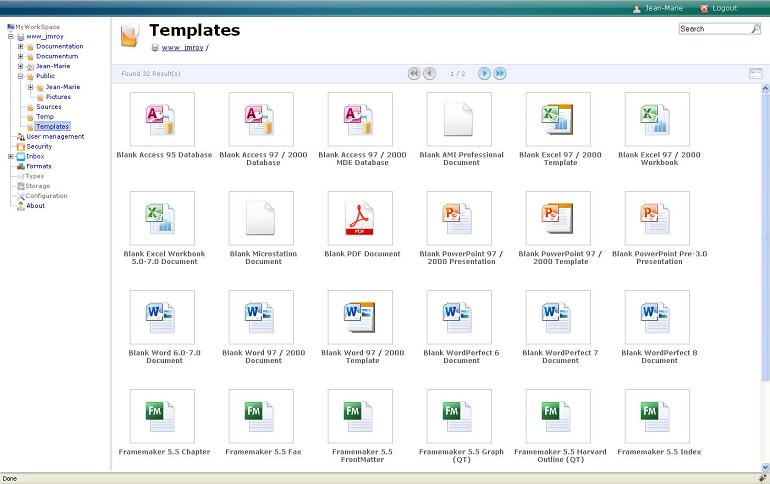
  
Templates management screen.

 

  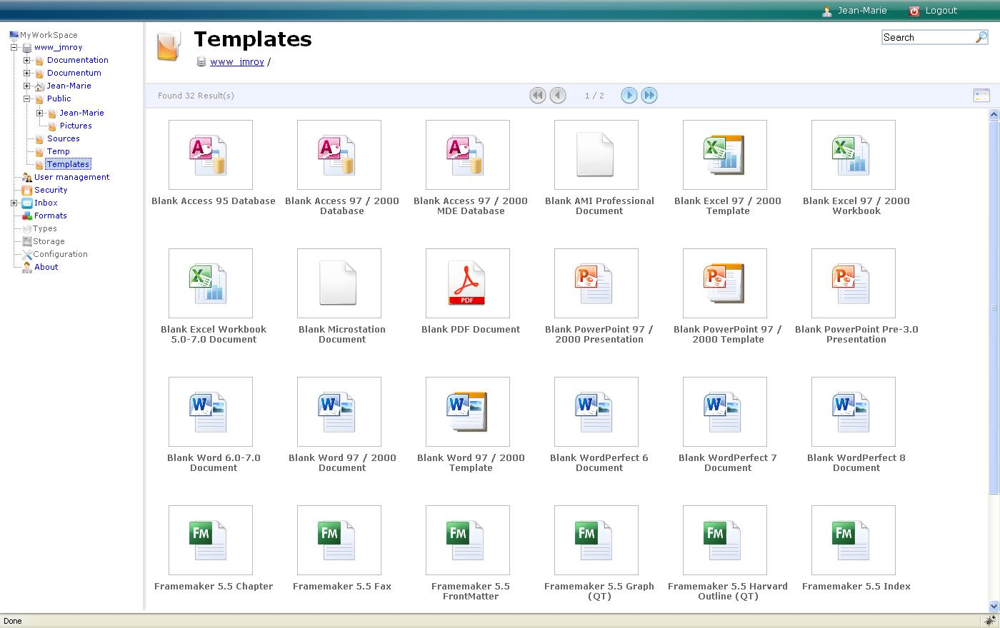
  
New templates creation/editing screen.

 

  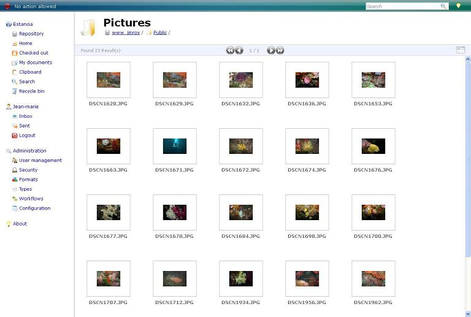
  
Thumbnail view.

 

  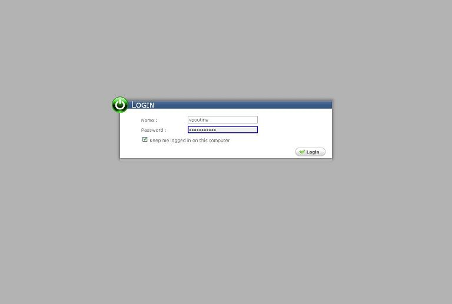
  
User access permissions.

 

  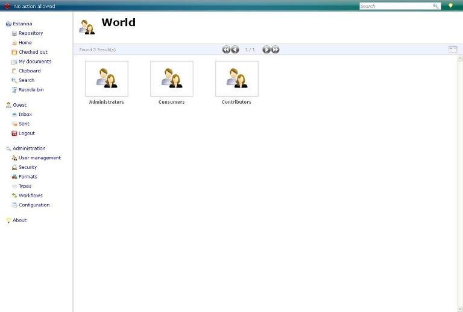
  
User management screen.

 

  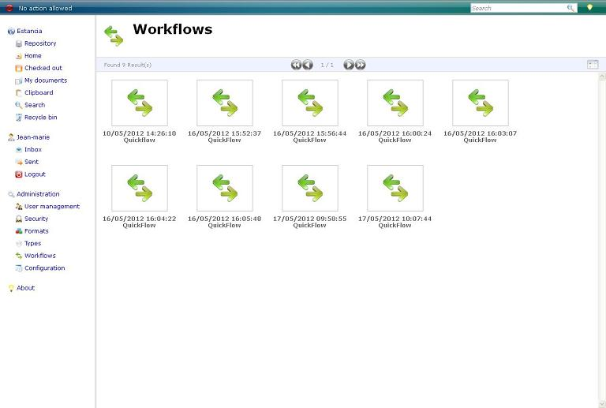
  
Workflows screen.

## License

Licensed under the Apache License, Version 2.0 (the "License");
you may not use this file except in compliance with the License.
You may obtain a copy of the License at:

- https://www.apache.org/licenses/LICENSE-2.0
